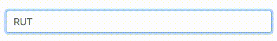

# Text Mask RUT

[](http://nodejs.org/download/)
[](https://nodesecurity.io/orgs/luisurrutia/projects/f3a88dff-5825-471b-87fc-07a2b513c1ac)

A Text Mask addon to format the Chilean National Identifier Number (RUT)




## Installation

```sh
yarn add text-mask-rut
```

## Usage example

React Example
```javascript
import React from 'react'
import MaskedInput from 'react-text-mask'
import createRutMask from 'text-mask-rut';

export default () => (
  <div>
    <MaskedInput
      mask={createRutMask}
    />
  </div>
)
```

Vanilla JS Example
```javascript
var myInput = document.querySelector('.maskedInput');

vanillaTextMask.maskInput({
  inputElement: myInput,
  mask: createRutMask(),
});
```

## Development setup
There isn't additional steps to:
```sh
yarn install
```

But always check the tests and lint before to commit or PR

## Release History

* 0.0.2
    * Fix UMD build
    * Reformat main code
    * Add integrations with travis, coveralls, codeclimate and NodeSecurity
    * Add example
    * Improve README

* 0.0.1
    * Work in progress

## Licencing

Distributed under the MIT license. See ``LICENSE`` for more information.


## Contributing

1. Fork it (<https://github.com/LuisUrrutia/text-mask-rut/fork>)
2. Create your feature branch (`git checkout -b feature/fooBar`)
3. Commit your changes (`git commit -am 'Add some fooBar'`)
4. Check the tests and lint (`yarn lint && yarn test`)
5. Push to the branch (`git push origin feature/fooBar`)
6. Create a new Pull Request
